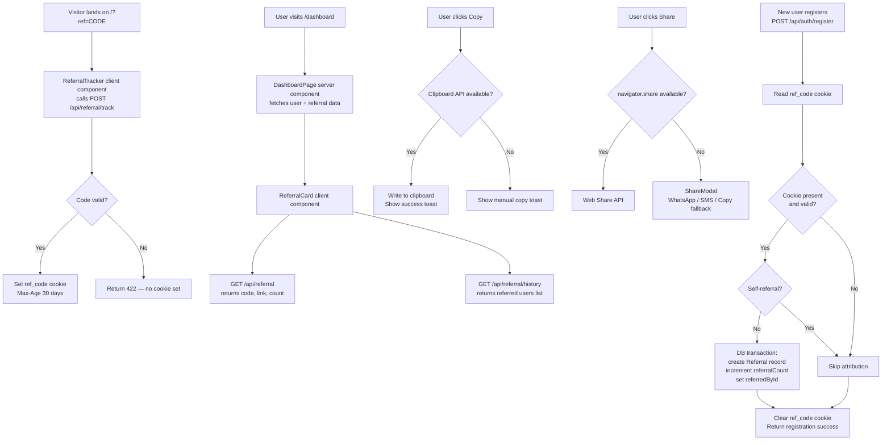

# Design Document — Referral System

## Overview

The Referral System adds a viral growth loop to GoPlay11 without touching any existing code paths. It is built as a self-contained addition to the existing Next.js App Router project: three new API routes, one new server component helper, one new client component (`ReferralCard`), a Prisma schema migration, and cookie-based referral tracking injected at the registration boundary.

The design follows every existing project convention:
- Inline styles, dark theme, `#ff5b16` accent colour
- `ok()` / `err()` response helpers from `lib/api-response.ts`
- `requireAuth()` guard from `lib/auth/utils.ts`
- Zod validators in `lib/validators/index.ts`
- Rate limiting via `lib/rate-limit.ts`
- Error logging via `lib/logger.ts`
- Audit logging via `lib/audit.ts`

---

## Architecture



### Key Design Decisions

1. **Lazy code generation** — Referral codes are generated on first `GET /api/referral` call, not at registration time. This avoids generating codes for users who never engage with the referral feature and keeps migration risk zero.

2. **Cookie-based tracking (not sessionStorage)** — Cookies survive navigation, browser refresh, and cross-tab behaviour. `HttpOnly=false` is intentional so the client can read the cookie to pre-fill UI where needed.

3. **Atomic transaction for attribution** — `Referral` record creation and `referralCount` increment happen inside a single `prisma.$transaction`, preventing split-brain scenarios.

4. **Separate `ReferralCard` client component** — The dashboard page remains a server component. Only the referral card (which needs clipboard/share APIs and interactive state) is client-side, matching the existing `UserNav` pattern.

5. **`referredUserId @unique` prevents double-counting** — The unique constraint on `Referral.referredUserId` means any duplicate insertion (race condition or retry) throws a known Prisma error that is caught and handled silently.

---

## Components and Interfaces

### New Files

```
app/
  (public)/
    page.tsx                         (MODIFIED — add ReferralTracker)
  dashboard/
    page.tsx                         (MODIFIED — add ReferralCard)
  api/
    referral/
      route.ts                       (NEW — GET /api/referral)
      history/
        route.ts                     (NEW — GET /api/referral/history)
      track/
        route.ts                     (NEW — POST /api/referral/track)
      share-analytics/
        route.ts                     (NEW — POST /api/referral/share-analytics, optional)

components/
  referral/
    ReferralCard.tsx                 (NEW — client component)
    ReferralTracker.tsx              (NEW — client component, invisible, cookie setter)
    ShareModal.tsx                   (NEW — client component)
    Toast.tsx                        (NEW — client component, ARIA live region)

lib/
  referral.ts                        (NEW — server-side helpers: generateCode, getOrCreateCode, processReferral)
  validators/
    index.ts                         (MODIFIED — add referral Zod schemas)
  rate-limit.ts                      (MODIFIED — add referralLimiter, trackLimiter)
```

### `lib/referral.ts` — Server-Side Helpers

```typescript
// Generates a cryptographically secure URL-safe referral code
// Uses crypto.randomBytes → base64url encoding, 12 chars minimum
export async function generateReferralCode(): Promise<string>

// Gets existing code or generates+stores a new one (with retry on collision)
export async function getOrCreateReferralCode(userId: string): Promise<string>

// Builds the full referral link from env var
export function buildReferralLink(code: string): string

// Reads ref_code from request cookies, validates format, returns code or null
export function extractReferralCode(request: NextRequest): string | null

// Runs the referral attribution transaction after registration
// Returns 'attributed' | 'self_referral' | 'already_referred' | 'invalid_code' | 'skipped'
export async function processReferralAttribution(
  newUserId: string,
  referralCode: string
): Promise<ReferralAttributionResult>
```

### `components/referral/ReferralCard.tsx`

Client component. Props: none (fetches own data). Internal state:

| State | Type | Purpose |
|-------|------|---------|
| `referralData` | `ReferralInfo \| null` | Code, link, count from API |
| `history` | `ReferralHistoryItem[]` | List of referred users |
| `loading` | `boolean` | Skeleton display |
| `historyLoading` | `boolean` | History skeleton |
| `error` | `string \| null` | API error message |
| `historyError` | `string \| null` | History API error |
| `toast` | `ToastState \| null` | Active toast |
| `shareModalOpen` | `boolean` | Share modal visibility |

### `components/referral/ReferralTracker.tsx`

Invisible client component rendered on the public home page. Reads `?ref` from `useSearchParams()`, calls `POST /api/referral/track`, sets no visible UI.

### `components/referral/ShareModal.tsx`

Modal rendered when `navigator.share` is unavailable. Props: `open`, `onClose`, `referralLink`. Uses `role="dialog"`, `aria-modal="true"`, focus trap, Escape-key handler.

### `components/referral/Toast.tsx`

Small component rendered at the bottom of `ReferralCard`. Uses `aria-live="polite"`, `aria-atomic="true"`. Auto-clears after 3 seconds.

---

## Data Models

### Prisma Schema Additions

```prisma
// ─── New enum ─────────────────────────────────────────────────────────────────

enum ReferralStatus {
  PENDING
  CONFIRMED
}

enum ShareChannel {
  COPY
  WHATSAPP
  SMS
  NATIVE
}

// ─── Additions to User model ──────────────────────────────────────────────────
// Add inside the User model:

  referralCode    String?   @unique
  referralCount   Int       @default(0)
  referredById    String?

  // Relations (add to User model)
  referredBy         User?      @relation("UserReferrals", fields: [referredById], references: [id])
  referredUsers      User[]     @relation("UserReferrals")
  referralsMade      Referral[] @relation("ReferrerReferrals")
  referralReceived   Referral?  @relation("ReferredUserReferral")
  shareAnalytics     ReferralShareAnalytics[]

  // Indexes (add to User model)
  @@index([referralCode])
  @@index([referredById])

// ─── New Referral model ───────────────────────────────────────────────────────

model Referral {
  id              String         @id @default(cuid())
  referrerId      String
  referredUserId  String         @unique     // prevents double-count
  status          ReferralStatus @default(CONFIRMED)
  createdAt       DateTime       @default(now())

  referrer        User           @relation("ReferrerReferrals", fields: [referrerId], references: [id])
  referredUser    User           @relation("ReferredUserReferral", fields: [referredUserId], references: [id])

  @@index([referrerId])
  @@index([createdAt])
}

// ─── Optional: Share analytics model ─────────────────────────────────────────

model ReferralShareAnalytics {
  id        String       @id @default(cuid())
  userId    String
  channel   ShareChannel
  createdAt DateTime     @default(now())

  user      User         @relation(fields: [userId], references: [id], onDelete: Cascade)

  @@index([userId])
  @@index([channel])
  @@index([createdAt])
}
```

### TypeScript Interfaces

```typescript
// Returned by GET /api/referral
interface ReferralInfo {
  code: string;
  link: string;
  count: number;
}

// Item in GET /api/referral/history response
interface ReferralHistoryItem {
  referredUserFirstName: string; // masked first name
  joinedAt: string;              // ISO date string
  status: "PENDING" | "CONFIRMED";
}

type ReferralAttributionResult =
  | "attributed"
  | "self_referral"
  | "already_referred"
  | "invalid_code"
  | "skipped";
```

---

## Correctness Properties

*A property is a characteristic or behavior that should hold true across all valid executions of a system — essentially, a formal statement about what the system should do. Properties serve as the bridge between human-readable specifications and machine-verifiable correctness guarantees.*

### Property 1: Referral Code Uniqueness

*For any* set of users who each independently trigger referral code generation, no two users should share the same referral code.

**Validates: Requirements 1.4**

### Property 2: Referral Code Idempotence

*For any* user who already has a referral code, calling `getOrCreateReferralCode` multiple times should always return the same code and never overwrite it.

**Validates: Requirements 1.3**

### Property 3: Referral Link Round-Trip

*For any* referral code stored in the database, the `?ref=` parameter extracted from the constructed referral link should equal the original code.

**Validates: Requirements 2.1**

### Property 4: Self-Referral Prevention

*For any* user who registers using their own referral code, no Referral record should be created and the user's `referralCount` should remain unchanged.

**Validates: Requirements 10.3, 6.2**

### Property 5: Duplicate Referral Prevention

*For any* user who has already been attributed as a referred user, a second registration attempt (or race-condition retry) with the same referral code should not create a second Referral record and should not increment `referralCount` a second time.

**Validates: Requirements 6.6, 14.5**

### Property 6: Attribution Atomicity

*For any* successful referral attribution, either both the Referral record is created AND `referralCount` is incremented, or neither operation occurs.

**Validates: Requirements 6.2, 10.4**

### Property 7: Referral Count Consistency

*For any* user, the value of `User.referralCount` should equal the number of `Referral` records where `referrerId` matches that user's id.

**Validates: Requirements 6.2, 11.1**

### Property 8: Cookie Persistence Across Valid Codes

*For any* visitor who sets a valid referral cookie and subsequently visits additional referral links, the original cookie value should be preserved unchanged.

**Validates: Requirements 5.6**

### Property 9: Invalid Code Rejection

*For any* referral code string that does not exist in the database or fails the safe-string validation pattern, the tracking endpoint should reject the request without setting a cookie.

**Validates: Requirements 5.3, 10.2**

### Property 10: History Masking

*For any* referral history entry, the displayed name should reveal at most the first character of the referred user's name, with remaining characters replaced by asterisks.

**Validates: Requirements 8.2**

---

## Error Handling

| Scenario | Behavior |
|----------|----------|
| `getOrCreateReferralCode` collision on all 5 retries | Return HTTP 500 via `serverError()`, log error |
| `processReferralAttribution` transaction failure | Log error, complete registration, clear cookie |
| Duplicate `Referral` record (race condition) | Catch Prisma unique constraint error (P2002), treat as `already_referred`, no increment |
| Invalid/missing `ref_code` cookie at registration | Skip attribution, proceed normally |
| Malformed referral code in `?ref` parameter | Reject at `extractReferralCode` validator, return 422 |
| `GET /api/referral` failure in `ReferralCard` | Show error state + retry button; other cards unaffected |
| `GET /api/referral/history` failure | Show inline history error; referral link/count still visible |
| Clipboard API unavailable | Show "select and copy manually" toast |
| Web Share API cancelled | Catch `AbortError`, no error shown |
| Network timeout on any API route | Return HTTP 500 via `serverError()` |
| Rate limit exceeded | Return HTTP 429 with `Retry-After` header via `tooManyRequests()` |

---

## Testing Strategy

### Unit Tests (example-based)

- `generateReferralCode()` produces a string matching `/^[A-Za-z0-9_-]{12,}$/`
- `buildReferralLink()` correctly appends `?ref=<code>` to the base URL
- `extractReferralCode()` returns null for malformed cookies
- `processReferralAttribution()` returns `self_referral` when `newUserId === referrerId`
- `processReferralAttribution()` returns `already_referred` when Prisma P2002 is thrown
- `ReferralCard` renders loading skeleton before data arrives
- `ReferralCard` renders error state with retry button on API failure
- `ShareModal` closes on Escape key press
- History masking produces correct output for names with 0, 1, 2+ words

### Property-Based Tests

Use [fast-check](https://fast-check.io/) (no new dev dependency needed — add `fast-check` as devDependency).

Each property test runs minimum 100 iterations.

- **Property 2** — Idempotence: generate arbitrary userId strings, call `getOrCreateReferralCode` twice (mocking DB), assert same code returned both times.
- **Property 3** — Round-trip: for any string matching code format, `buildReferralLink(code)` → extract `?ref` param → should equal original code.
- **Property 4** — Self-referral: for any userId, `processReferralAttribution(userId, codeOwnedByUserId)` → result is `self_referral`, no DB writes.
- **Property 5** — Duplicate prevention: for any (referrerId, referredUserId) pair, simulate P2002 on second call → result is `already_referred`, count not incremented twice.
- **Property 7** — Count consistency: generate random arrays of distinct referred user ids, run attribution for each, assert `referralCount === referralRecords.length`.
- **Property 9** — Invalid code rejection: generate arbitrary strings not matching `/^[A-Za-z0-9_-]{12,64}$/`, assert `extractReferralCode` returns null and track endpoint returns 422.
- **Property 10** — History masking: for any string input as user name, assert masked output matches `/^.\*+$/` or is `"Anonymous"` for empty names.

### Integration Tests

- `POST /api/referral/track` with a valid code in DB → response 200, cookie header present
- `GET /api/referral` unauthenticated → 401
- `GET /api/referral/history` unauthenticated → 401
- `POST /api/auth/register` with valid `ref_code` cookie → Referral record created, count incremented
- `POST /api/auth/register` twice with same referral code → count incremented exactly once
- Rate-limit: 21st request to `POST /api/referral/track` within 1 minute → 429

### Tag Format for Property Tests

```
// Feature: referral-system, Property 2: Referral Code Idempotence
// Feature: referral-system, Property 3: Referral Link Round-Trip
```
